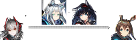

# Moe

我并不关注游戏内的 hetero 特性。

## Arknights

此游戏下，所有角色的 icon 严格指定皮肤和版本，故脚注其实更精确。

### Multi

$$ \text{W}^* \xrightarrow{\text{Rosmontis} + \text{Blaze}} \text{Amiya} $$ 

此角色组[^w-amiya]已匹配候选画师。

[^w-amiya]: 

$$ \text{Lappland}^* \leftrightarrows \text{Suzuran} $$

此角色组[^lapp-szrn]已匹配候选画师。

[^lapp-szrn]: 

$$ \text{Blaze}^* \rightarrow \text{Amiya} $$

此角色组[^blaze-amiya]未匹配到画师。

[^blaze-amiya]: 

### Single

以下角色已匹配最佳画师。

$\text{Mizuki}$ [^mizuki]

[^mizuki]: 

以下角色已匹配候选画师。

$\text{Amiya, Solo Around The World}$ [^amiyasatw]

[^amiyasatw]: 

以下角色未匹配到画师。

$\text{Asbestos}$ [^asbestos]

[^asbestos]: 

$\text{Ceobe, Unfettered}$ [^ceobe2]

[^ceobe2]: 

$\text{Shamare}$ [^shamare]

[^shamare]: 

$\text{Sora}$ [^sora]

[^sora]: 

$\text{Sussurro}$ [^sussurro]

[^sussurro]: 

$\text{Suzuran}$ [^suzuran]

[^suzuran]: 

$\text{Suzuran, Yukibare}$ [^suzuran3]

[^suzuran3]: 

## Blue Archive