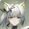
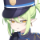

# Moe

1. 我并不关注游戏内的 hetero 特性。
2. 在同一 heading 下面的角色及角色组存在排序，依据为偏爱程度。不同 heading 之间的偏爱程度无法比较。
3. 未列出的角色 _就是_ 代表一点兴趣都没有。

## Arknights

此 Copyright 下，所有角色的版本均由 svg 精确指定。

### Multi

$$ \text{W}^* \xrightarrow{\text{Rosmontis} + \text{Blaze}} \text{Amiya} $$ 

此角色组[^w-amiya]已匹配到候选画师。

[^w-amiya]: 

$$ \text{Lappland}^* \leftrightarrows \text{Suzuran} $$

此角色组[^lapp-szrn]未匹配到画师。

[^lapp-szrn]: 

$$ \text{Blaze}^* \rightarrow \text{Amiya} $$

此角色组[^blaze-amiya]未匹配到画师。

[^blaze-amiya]: 

### Single

以下角色已匹配到最佳画师。

- $\text{Mizuki}$ [^mizuki]

[^mizuki]: 

以下角色已匹配到候选画师。

- $\text{Amiya (Solo Around The World)}$ [^amiyasatw]
- $\text{Kal'tsit (2024 Ambience Synesthesia)}$ [^kaltsitas]

[^amiyasatw]: 
[^kaltsitas]: 

以下角色未匹配到画师。

- $\text{Shamare}$
- $\text{Asbestos}$,
- $\text{Ceobe (Unfettered)}$,
- $\text{Sora}$,
- $\text{Sussurro}$
- $\text{Suzuran}$
- $\text{Suzuran (Yukibare)}$ [^arknights-non]

[^arknights-non]:       

## Blue Archive

1. Blue Archive 没有 Multi 的一大部分原因是角色是轻度原子化 [^atomic]和高度结构化[^structured]的。
2. 此 Copyright 下，所有角色的版本均由 svg 精确指定。

[^atomic]: 考虑「学生」所在的小组剧情和个人剧情的比重。
[^structured]: 可以为每个「学生」建立一个主树，然后在下面建立一个子树「羁绊剧情」。

### Single

以下角色已匹配到最佳画师。

- $\text{Nozomi}$ [^nozomi]

[^nozomi]: 